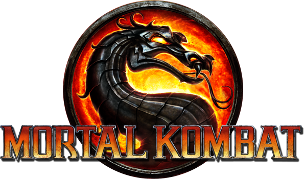

# Mortal_Kombat

<h1>Description</h1>

This web-browser based game was primarily focused on dynamically updating the DOM this includes: function methods, mouse and click events, changing CSS styling, creating elements and appending to the HTML, and more. My goal while creating this was to create a smooth and pleasant performing game for the user. To make it more interactive/immersive, it also includes audio for sound effects, player selection, and more.

It features a player selection menu where--depending on the user's selection of choice as well as the selection of the opponent--it will display a video-game-like experience. In order to attack, the user would click on the attack button and then experience dynamically changing elements on the UI. Each character has different attack and counter attack powers.

