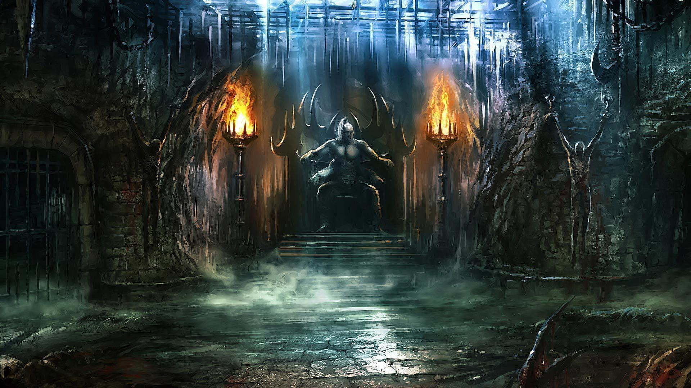

# Mortal_Kombat

<h1>Description</h1>

This web-browser based game was primarily focused on dynamically updating the DOM this includes: function methods, mouse and click events, changing CSS styling, creating elements and appending to the HTML, and more. My goal while creating this was to create a smooth and pleasant performing game for the user. To make it more interactive/immersive, it also includes audio for sound effects, player selection, and more.

It features a player selection menu where--depending on the user's selection of choice as well as the selection of the opponent--it will display a video-game-like experience. In order to attack, the user can choose 4 different main character:<li>Johnny Cage</li><li>Raiden</li> <li>Scorpion</li><li>Sub-Zero</li>.After you pick your fighter. Next screen will step into Arena. I create 2 enemy for this game:<li> Liu Kang </li><li>Kung Lao</li> for battle. After that you can attack you enemy. Each character has different attack and counter attack powers.

<h2>Arena to battle</h2>

<h3>Fighters</h3>
<li>Johnny Cage</li>
<li>Scorpion</li>
<li>Sub-Zero</li>
<li>Raiden</li>

